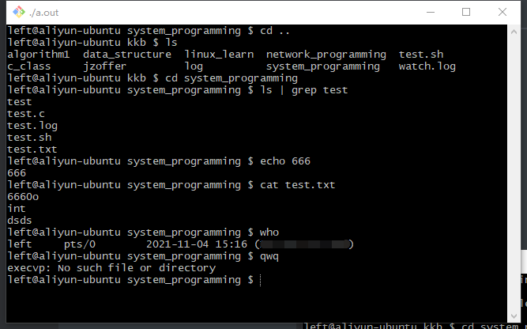
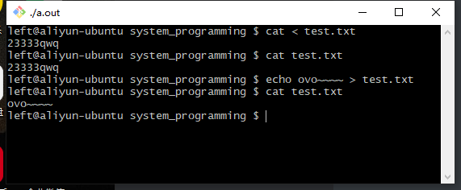
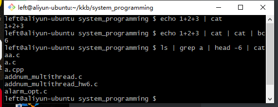
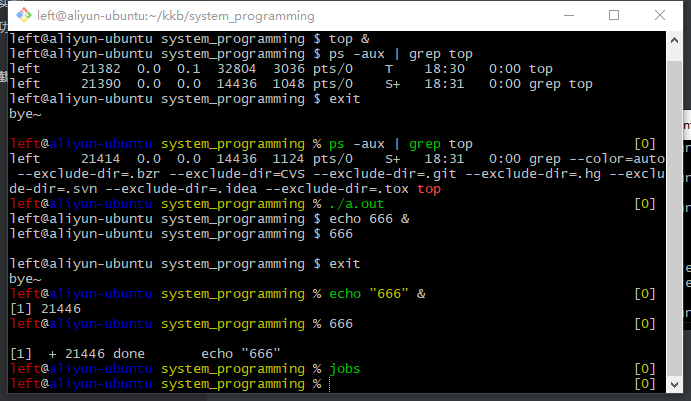
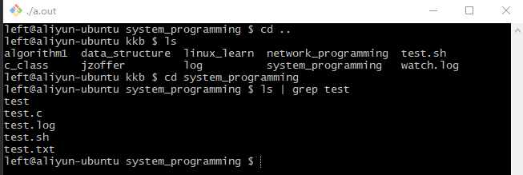

# linux下实现简版myshell


## 功能实现

1. ohmyzsh同款命令提示符
2. 实现了shell的基本功能，即exec程序调用
3. 实现了重定向输入、输出功能
4. 实现了多管道功能
5. 实现了后台功能（可能有bug）
6. 实现了cd功能（即更改工作目录）


## 重要功能介绍


------

### 1.exec族介绍：

------

翻阅man手册，man手册是这样解释exec族的：

> exec族函数会替换掉当前进程，取而代之的是指定的新进程。

个人理解就是，当你调用了exec函数的时刻，当前进程就不是当前进程了（感觉在讲废话 = =），因为exec会“开启”一个新的进程，但是这个进程取代了原来的旧进程运行，被取代后，该进程跑的是新任务，旧的任务就不再执行了。


- exec家族都有那些？

> execl, execlp, execle, execv, execvp, execvpe

这么多家族成员，死记硬背肯定记不下。细心观察发现，家族成员都是以exec开头的函数，所以我们只要记后面的就行了：


l族表示参数是以列表的形式一个一个传参的，以NULL结尾，可以看看他的函数原型：`int execl(const char *path, const char *arg, .../* (char  *) NULL */);`


v族表示参数是以数组（vector（确信））的形式传参的，同样以NULL结尾（在最后一个参数下标位置的下一个置NULL），函数原型：`int execv(const char *path, char *const argv[]);`


p表示如果输入的file没有带 `/` 符号，exec族函数就会在环境变量PATH中寻找file。关于PATH我们可以在linux 中 输入命令 `echo $PATH` 查看相关路径。例如 `echo` 、 `cat` 、`ls` 等命令都是在环境变量PATH中查找并运行的。


e表示传入环境变量，这里的环境变量好像不止是PATH，如果使用了带e的函数，函数就回继承char *const envp[]形参中传入的环境变量并继承。但是这个好像我没这么用过我也不太清楚用法- -...


具体函数原型如下：

```c
int execlp(const char *file, const char *arg, .../* (char  *) NULL */);
int execle(const char *path, const char *arg, .../*, (char *) NULL, char * const envp[] */);
int execv(const char *path, char *const argv[]);
int execvp(const char *file, char *const argv[]);
int execvpe(const char *file, char *const argv[], char *const envp[]);
```

具体实现我用了分割成数组的方法，读者萌可以自行探索一下。


------

### 2.实现了重定向输入、输出功能

-------

- 文件描述符简介

每个进程都会保存一份文件描述符，通过文件描述符就可以找到对应的文件，并且能对对应的文件进行一系列文件操作。linux操作系统中我们就是通过操作 0/1/2 描述符来进行标准输入和标准输出的。 


实现shell的重定向输入输出就是对重定向的运用，两个重定向函数函数原型如下：

```c
int dup(int oldfd);
int dup2(int oldfd, int newfd);
```

这里的oldfd是被替换的旧文件描述符指向的文件、newfd是指旧文件描述符指向的文件被新的文件描述符给指向。


举个栗子，如果我们需要实现以下指令的功能 ：`printf "123" > test.log`

而我们知道，标准输出对应的文件描述符为 `1` ，我们只需要将标准输出重定向到test.log即可，对应操作如下：

```c
int fd = open("test.log", O_RDWR | O_CREAT, 0644);//打开一个文件，返回文件描述符
int fd_out = dup(1); //重定向到标准输出指向的文件，方便后续重定向回去
dup2(fd, 1); //将标准输出重定向到test.log
printf("123");
dup2(fd_out, 1); //记得将标准输出重定向回原来的文件
```

这样简单的重定向输出就完成了，重难点就是这些具体实现希望读者萌自行探索一下qwq


------

### 3.实现了多管道功能

------

- 管道介绍

函数原型如下：

```c
int pipe(int pipefd[2]);
int pipe2(int pipefd[2], int flags);//一般用不到，除非设置非阻塞啥的
```

man手册介绍如下：

> pipe() 创建一个管道（单向流动的数据通道）用于进程间通信。调用函数返回两个文件描述符，存放下标为0的描述符指向管道读端，下标为1的指向管道写端。


对于多管道，我是这样实现的：

1. 创建一个二维管道数组 `pipefd[20][2]`，[20]表示可以存放20个管道。
2. 父进程负责对管道的重定向。
3. 重定向后，父进程循环创建子进程。
4. 每个子进程要关闭与自己无关的管道避免阻塞（详见man手册管道特殊情况）。
5. 父进程传建完子进程后关闭所有管道（同样是避免阻塞）。


详情见代码（注释已经写得很详细了QwQ）


------

### 4.实现了后台功能（可能有bug）
------

- **进程和作业简介：**
  - **区别**：进程是一个程序在一个数据集上的一次执行，而作业是用户提交给系统的一个任务。
  - **关系**：一个作业通常包括几个进程，几个进程共同完成一个任务，即作业。
  - 用户提交作业以后，当作业被调度，系统会为作业创建进程，一个进程无法完成时，系统会为这个进程创建子进程。


具体实现如下：

设置进程组id：` int setpgid(pid_t pid, pid_t pgid);` 每个进程组表示一个作业

把进程组设置到前台：`int tcsetpgrp(int fd, pid_t pgrp);`

父进程屏蔽掉SIGTTOU信号：`signal(SIGTTOU, SIG_IGN);` 因为当shell从后台调用tcsetpcgrp时候会收到该信号


------

### 5.实现了cd功能（即更改工作目录）

------

这个没啥了吧，就一个chdir函数。注意需要在父进程中执行。


------

## 代码

```c
#define _GNU_SOURCE
#include<signal.h>
#include<stdio.h>
#include<sys/stat.h>
#include<sys/types.h>
#include<sys/wait.h>
#include<unistd.h>
#include<stdlib.h>
#include<string.h>
#include<fcntl.h>
#include<pwd.h>
#define MAXLEN 1024
#define PIPESIZE 20

//运行cd，即切换工作目录
void run_cd(char* path)
{
    if(chdir(path) < 0)
        perror("chdir");
}

//运行命令
//实现功能：1.重定向输入输出 2.管道功能
void run_cmd(char* cmdvec[MAXLEN], int cmd_cnt, int is_bg)
{
    //fcpid：将第一个子进程id设为所有子进程的进程组以及设置前台
    //pipefd：管道描述符，每个子进程各存一份
    int fcpid, cmd_idx, pipefd[PIPESIZE][2];

    //重定向输出（输入）的新（旧）文件描述符
    int new_fd_in, old_fd_in, new_fd_out, old_fd_out;

    //父进程创建管道
    for(cmd_idx = 0; cmd_idx < cmd_cnt - 1; cmd_idx++)
    {
        if(pipe(pipefd[cmd_idx]) < 0)
        {
            perror("pipe");
            exit(1);
        }
    }

    //父进程任务：创建cmd_cnt个子进程
    //子进程任务：重定向并执行命令
    for(cmd_idx = 0; cmd_idx < cmd_cnt; cmd_idx++)
    {
        int pid = fork();
        if(pid < 0)
        {
            perror("fork");
            exit(1);
        }

        //父进程创建完子进程后继续循环
        if(pid)
        {
            if(!cmd_idx) fcpid = pid;

            //设置所有子进程进入第一个进程的进程组
            setpgid(pid, fcpid);

            //把新的进程组设置到前台
            if(!cmd_idx && !is_bg) tcsetpgrp(0, fcpid);

            continue;
        }

        //子进程关闭父进程继承下来的无关管道
        for(int j = 0; j < cmd_cnt - 1; j++)
        {
            if(j == cmd_idx || j == cmd_idx - 1) continue;
            close(pipefd[j][0]);
            close(pipefd[j][1]);
        }
        if(cmd_cnt != 1)
        {
            //第一个命令的管道重定向操作
            if(cmd_idx == 0)
            {
                dup2(pipefd[cmd_idx][1], 1);
                close(pipefd[cmd_idx][0]);
            }
            //最后一个命令的管道重定向操作
            else if(cmd_idx == cmd_cnt - 1)
            {
                dup2(pipefd[cmd_idx - 1][0], 0);
                close(pipefd[cmd_idx - 1][1]);
            }
            //其他命令的管道重定向操作
            else
            {
                dup2(pipefd[cmd_idx][1], 1);
                dup2(pipefd[cmd_idx - 1][0], 0);
                close(pipefd[cmd_idx][0]);
                close(pipefd[cmd_idx - 1][1]);
            }
        }

        //子进程解析命令及重定向
        int cmdl_cnt = 0;
        char* cmdl[MAXLEN], *cmd;
        cmd = cmdvec[cmd_idx];
        //printf("%s\n", cmd);
        cmdl[cmdl_cnt++] = strtok(cmd, " ");
        while(cmdl[cmdl_cnt] = strtok(NULL, " "))
        {
            //处理重定向输入
            if(!strcmp("<", cmdl[cmdl_cnt]))
            {
                old_fd_in = dup(0);
                char* filepath = strtok(NULL, " ");
                //printf("%s\n", filepath);
                new_fd_in = open(filepath, O_RDONLY);
                if(new_fd_in < 0)
                {
                    perror("open");
                    return;
                }
                dup2(new_fd_in, 0);
                close(new_fd_in);
            }
            //处理重定向输出
            else if(!strcmp(">", cmdl[cmdl_cnt]))
            {
                old_fd_out = dup(1);
                char* filepath = strtok(NULL, " ");
                //printf("%s\n", filepath);
                new_fd_out = open(filepath,
                                           O_TRUNC | O_CREAT | O_RDWR,
                                           0644);
                if(new_fd_out < 0)
                {
                    perror("open");
                    return;
                }
                dup2(new_fd_out, 1);
                close(new_fd_out);
            }
            //遇到后台则忽略，分割命令时候已经判断后台了
            else if(!strcmp("&", cmdl[cmdl_cnt]));
            else cmdl_cnt++;
        }

        /*
        for(int i = 0; cmdl[i]; i++)
            printf("%s\n", cmdl[i]);
        */
        execvp(cmdl[0], cmdl);
        perror("execvp");
        exit(1);

    }

    //父进程关闭管道
    for(cmd_idx = 0; cmd_idx < cmd_cnt - 1; cmd_idx++)
    {
        close(pipefd[cmd_idx][0]);
        close(pipefd[cmd_idx][1]);
    }

    for(cmd_idx = 0; cmd_idx < cmd_cnt; cmd_idx++)
    {
        if(!is_bg) wait(NULL);
    }

    //前台作业完成后，把shell设置到前台
    if(!is_bg) tcsetpgrp(0, getpid());
    //if(is_bg) printf("is bg\n");
}

//根据管道切分命令,解析是否有后台参数
//return val:分割的命令条数
int split_cmd_with_pipe(char* buf, char* retvec[MAXLEN], int* is_bg)
{
    if(strstr(buf, " &")) *is_bg = 1;
    else *is_bg = 0;
    int cnt = 0;
    retvec[cnt++] = strtok(buf, "|");
    while(retvec[cnt] = strtok(NULL, "|"))
        cnt++;
    return cnt;
}

//解析命令并运行
void run_shell(char* buf)
{
    int is_bg;
    char *cmd_vec[MAXLEN];

    //按照分割命令,解析命令是否为后台命令
    //并返回以管道为分隔符分割的命令数
    int cmd_cnt = split_cmd_with_pipe(buf, cmd_vec, &is_bg);
    if(!cmd_cnt) return;

    //判断是否为cd命令
    //如果是直接执行cd命令，否则执行exec命令
    if(!strncmp("cd ", cmd_vec[0], 3))
    {
        char *cd_temp = strtok(cmd_vec[0], " ");
        cd_temp = strtok(NULL, " ");
        run_cd(cd_temp);
    }
    else run_cmd(cmd_vec, cmd_cnt, is_bg);
}

//父进程收到子进程退出命令后，回收子进程
void handler(int sig)
{
    waitpid(-1, NULL, WNOHANG);
}

int main()
{
    //先屏蔽掉SIGTTOU信号，因为当shell从后台调用tcsetpcgrp时候会收到该信号
    signal(SIGTTOU, SIG_IGN);

    //后台设置，收到SIGCHLD后等待子进程。
    signal(SIGCHLD, handler);
    char buf[MAXLEN];
    while(1)
    {
        //获取登录用户名
        struct passwd *pw = getpwuid(getuid());
        char wd[MAXLEN], hostname[MAXLEN], *pwd;

        //获取主机名
        gethostname(hostname, MAXLEN);

        //得到当前工作目录的最后一个目录
        getcwd(wd, MAXLEN);
        pwd = wd + strlen(wd);
        for(int i = strlen(wd) - 1; *pwd != '/' && pwd != wd; pwd--);
        if(*(pwd + 1) != 0) pwd++;
        printf("%s@%s %s $ ", pw -> pw_name, hostname, pwd);

        //获取命令
        char* buf_temp;
        long int buflen = MAXLEN;
        getline(&buf_temp, &buflen, stdin);

        //如果是空命令，则continue
        if(!strcmp("\n", buf_temp)) continue;
        sscanf(buf_temp, "%[^\n]", buf);
        if(!strcmp(buf, "exit"))
        {
            printf("bye~\n");
            exit(0);
        }
        run_shell(buf);
        *buf = 0;
    }
    return 0;
}
```


------

## 运行截图

1. exec测试




2. 重定向输入输出测试




3. 多管道测试




4. 后台测试



5. cd功能测试



